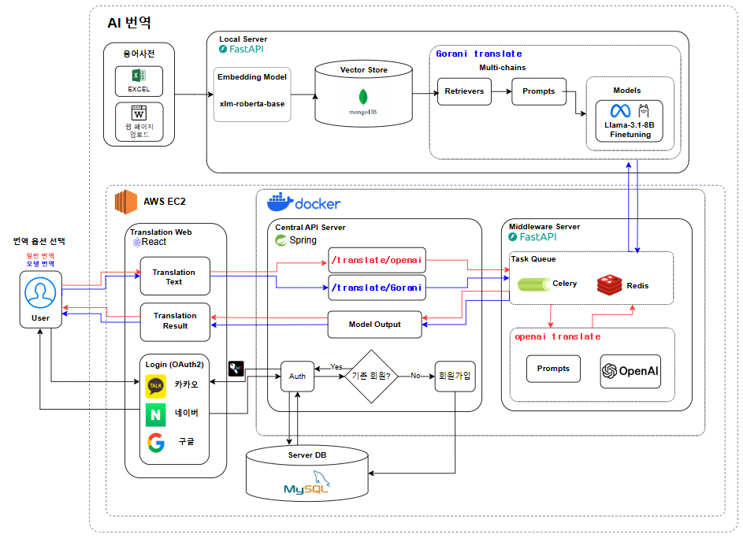
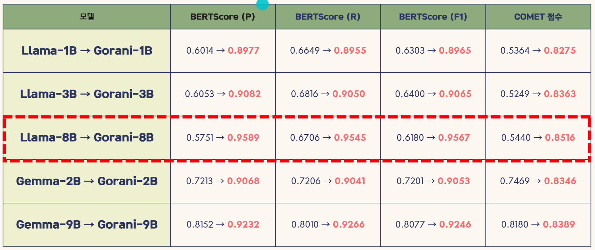

# 🦌 Gorani 번역 🦌

## 💻 프로젝트 개요  
**" 관광 산업의 새로운 AI 혁신, Gorani! " <br/>**

**Gorani**는 관광 산업에 특화된 자체 AI 언어 모델로, **LLAMA 모델을 기반으로 Fine-Tuning**하여 외국인 관광객을 위한 번역 성능을 향상시키는 프로젝트입니다. <br/>
한국을 방문하는 외국인 관광객 수는 매년 증가하고 있으며, 이에 따라 관련 산업도 빠르게 성장하고 있습니다.   <br/>
하지만 현재 많은 기업이 **보안 문제, 비용 부담, 커스텀 모델 부족** 등의 한계를 겪고 있어, **자체 LLM(대형 언어 모델) 개발**에 대한 필요성이 높아지고 있습니다.   <br/>

**Gorani는 이러한 흐름에 맞춰, 오픈소스 기반 LLM을 Fine-Tuning하여 관광 분야에 최적화된 AI 모델을 구축**된 모델입니다.   <br/>
이를 통해 **보다 정확하고 자연스러운 다국어 번역**을 지원하여 외국인 관광객의 경험을 향상시키고, 기업들이 보다 효율적으로 AI를 활용할 수 있도록 돕습니다.   <br/>

---

##  🔮 기대 효과  

**1. 관광 산업 맞춤형 AI 번역 서비스 제공**  
**2. 자체 LLM을 통한 비용 절감 및 보안 강화**  
**3. 다국어 지원 최적화로 외국인 관광객의 편의 증대**  


## 🧑‍🤝‍🧑 `멤버구성`

 - 🐯 팀장: 임현성
 - 🦓 이현승
 - 🐶 지동현
 - 🐹 배하은
 - 🦝 노태윤


<br/>

## ⚙️ `개발 환경`


 


 


<br/>
<br/><h2>📂 패키지구조</h2>

  <summery><b>프론트엔드 패키지 구조</b></summery>
  <div markdown="1">
<details>
  <summary>코드</summary>
 
```
📦src
 ┣ 📂Apis
 ┃ ┣ 📜index.jsx
 ┃ ┣ 📜TranslateAPI.jsx
 ┃ ┗ 📜UserAPI.jsx
 ┣ 📂assets
 ┃ ┣ 📂css
 ┃ ┃ ┣ 📂Common
 ┃ ┃ ┃ ┣ 📜footer.css
 ┃ ┃ ┃ ┣ 📜header.css
 ┃ ┃ ┃ ┗ 📜modal.css
 ┃ ┃ ┣ 📂Main
 ┃ ┃ ┃ ┗ 📜main.css
 ┃ ┃ ┣ 📂Translation
 ┃ ┃ ┃ ┣ 📜glossary.css
 ┃ ┃ ┃ ┣ 📜GlossaryModal.css
 ┃ ┃ ┃ ┗ 📜translation.css
 ┃ ┃ ┣ 📂User
 ┃ ┃ ┃ ┣ 📜myPage.css
 ┃ ┃ ┃ ┣ 📜myPageModal.css
 ┃ ┃ ┃ ┗ 📜user.css
 ┃ ┃ ┗ 📜all.css
 ┃ ┣ 📂font
 ┃ ┃ ┗ 📜SmoochSans-VariableFont_wght.ttf
 ┃ ┗ 📂svg
 ┃ ┃ ┣ 📜GitHub_Invertocat_Light.svg
 ┃ ┃ ┗ 📜hf-logo.svg
 ┣ 📂hooks
 ┃ ┗ 📜useGlossaryManager.js
 ┣ 📂pages
 ┃ ┣ 📂Common
 ┃ ┃ ┣ 📜Footer.jsx
 ┃ ┃ ┣ 📜Header.jsx
 ┃ ┃ ┗ 📜Modal.jsx
 ┃ ┣ 📂Login
 ┃ ┃ ┣ 📜GoogleLogin.jsx
 ┃ ┃ ┣ 📜GoogleSuccess.jsx
 ┃ ┃ ┣ 📜KakaoLogin.jsx
 ┃ ┃ ┣ 📜KakaoSucess.jsx
 ┃ ┃ ┣ 📜KakooCallBack.jsx
 ┃ ┃ ┣ 📜Naver.jsx
 ┃ ┃ ┗ 📜NaverSuccess.jsx
 ┃ ┣ 📂Main
 ┃ ┃ ┗ 📜main.jsx
 ┃ ┣ 📂Translation
 ┃ ┃ ┣ 📜Glossary.jsx
 ┃ ┃ ┣ 📜GlossaryList.jsx
 ┃ ┃ ┣ 📜GlossaryModal.jsx
 ┃ ┃ ┣ 📜Translation.jsx
 ┃ ┃ ┗ 📜WordPairEditor.jsx
 ┃ ┗ 📂User
 ┃ ┃ ┣ 📜MyPage.jsx
 ┃ ┃ ┗ 📜MyPageModal.jsx
 ┣ 📜App.js
 ┣ 📜App.test.js
 ┣ 📜index.css
 ┣ 📜index.js
 ┣ 📜logo.svg
 ┣ 📜reportWebVitals.js
 ┗ 📜setupTests.js

```
</details>


    
  </div>

   <summery><b>백엔드 패키지 구조</b><summery>
  <div markdown="1">

<details>
  <summary>코드</summary>
 
```
📦src
├─main
│  ├─java
│  │  └─com
│  │      └─tension
│  │          └─gorani
│  │              ├─auth
│  │              │  ├─controller
│  │              │  ├─dto
│  │              │  ├─filter
│  │              │  ├─handler
│  │              │  └─service
│  │              ├─common
│  │              ├─companies
│  │              │  ├─controller
│  │              │  ├─domain
│  │              │  │  ├─dto
│  │              │  │  └─entity
│  │              │  ├─repository
│  │              │  └─service
│  │              ├─config
│  │              ├─translation
│  │              │  ├─controller
│  │              │  ├─DTO
│  │              │  └─service
│  │              └─users
│  │                  ├─controller
│  │                  ├─domain
│  │                  │  ├─dto
│  │                  │  └─entity
│  │                  ├─repository
│  │                  └─service
│  └─resources
└─test
    └─java
        └─com
            └─tension
                └─gorani
```
</details>
    
  </div>

  <summery><b>Middle Server 패키지 구조</b></summery>
  <div markdown="1">

<details>
  <summary>코드</summary>
 
```
📦app
 ┣ 📂models
 ┃ ┣ 📜schemas.py
 ┃ ┣ 📜translation.py
 ┃ ┗ 📜__init__.py
 ┣ 📂routes
 ┃ ┣ 📜glossary_router.py
 ┃ ┣ 📜openai.py
 ┃ ┗ 📜translate.py
 ┣ 📂services
 ┃ ┣ 📜config.py
 ┃ ┣ 📜openai_service.py
 ┃ ┗ 📜translation_service.py
 ┣ 📜celery_worker.py
 ┗ 📜main.py

```
</details>
    
  </div>

  <summery><b>AI 패키지 구조</b></summery>
  <div markdown="1">

<details>
  <summary>코드</summary>
 
```
📦app
 ┣ 📂__pycache__
 ┃ ┗ 📜main.cpython-312.pyc
 ┣ 📂models
 ┃ ┣ 📂__pycache__
 ┃ ┃ ┣ 📜__init__.cpython-312.pyc
 ┃ ┃ ┣ 📜llama.cpython-312.pyc
 ┃ ┃ ┣ 📜schemas.cpython-312.pyc
 ┃ ┃ ┗ 📜translation.cpython-312.pyc
 ┃ ┣ 📜__init__.py
 ┃ ┣ 📜llama.py
 ┃ ┗ 📜schemas.py
 ┣ 📂routes
 ┃ ┣ 📂__pycache__
 ┃ ┃ ┗ 📜translate.cpython-312.pyc
 ┃ ┗ 📜translate.py
 ┣ 📂services
 ┃ ┣ 📂__pycache__
 ┃ ┃ ┣ 📜MongoDB.cpython-312.pyc
 ┃ ┃ ┣ 📜langGorani_service.cpython-312.pyc
 ┃ ┃ ┣ 📜llama_service.cpython-312.pyc
 ┃ ┃ ┗ 📜translation_service.cpython-312.pyc
 ┃ ┣ 📜langGorani_service.py
 ┃ ┗ 📜llama_service.py
 ┗ 📜main.py

```
</details>
    
  </div>

## 🎬 `아키텍처`
  

<br/>
<br/><h2>📌 주요 기능</h2>

### 🔍 번역 모델 Fine-Tuning  
- **Base Model:** LLAMA (1B / 3B / 8B)  
- **목표:** 여행/관광 도메인 번역 정확도 향상  
- **방법:**  
  - 문맥, 어휘 등을 고려한 **고품질 학습 데이터셋 수집 및 Fine-Tuning**  
  - **관광 관련 전문 용어 및 속어 반영**하여 보다 자연스러운 번역 제공  

### 📚 RAG & VectorStore 성능 향상  
- **다국어 번역 단어쌍 용어사전 구축**  
  - 여행/관광 업계에서 자주 사용되는 핵심 용어 정리 및 번역  
  - 단순 번역이 아닌 **문맥을 고려한 다국어 매칭** 수행  
- **각 단어에 대한 벡터 임베딩 값을 MongoDB에 저장**하여 빠르고 정확한 검색 성능 제공  
  - **VectorStore 기반 빠른 검색 및 추천 시스템 적용**  

### 📝 Prompt Engineering  
- **명확한 지시어 적용**  
  - 번역 품질을 높이기 위한 **세밀한 프롬프트 설계**  
  - 특정 국가별 문화적 차이를 반영한 **맞춤형 지시어 활용**  
- **One-shot & Few-shot 기법 활용**으로 다양한 입력 방식에 대응  
  - 사용자 입력 의도를 고려한 **다양한 응답 패턴 생성**  

### 📊 학습 성능 평가 비교
 

---

## 🗣️ 후기

>- <b>🐯 팀장: 임현성🐯 </b><br>


>- <b>🦓 이현승 🦓</b><br>


>- <b>🐹 배하은 🐹</b><br>
 저에게 Fine-Tuning은 늘 흥미롭지만, 시간과 자원의 한계로 쉽게 시도할 수 없었던 아쉬운 기술이었습니다. 그러나 이번 프로젝트를 통해 Fine-Tuning을 직접 학습하고 적용해볼 수 있어 매우 뜻깊은 경험이었습니다. <br/>
 뿐만 아니라, LangGraph, LangChain, Prompt Engineering, 유사도를 활용한 Embedding 기반 Index Search 등 다양한 기술을 적용하며 번역 성능을 최적화하는 과정이 무척 뿌듯했습니다. 특히, 직접 학습시킨 1B 모델의 경우 초기에는 원하는 대로 번역되지 않아 아쉬움이 컸기에, Fine-Tuning을 통해 직접 개선해보고 싶다는 강한 동기가 있었습니다.
그 결과, Fine-Tuning 이후 확연한 개선이 이루어졌고, 아직 완벽하지는 않지만 번역 품질 지표인 Comet Score와 BERT-Score에서 큰 향상을 확인할 수 있어 보람을 느꼈습니다. <br/>
 또한, 이번 프로젝트의 결과물을 허깅페이스(Hugging Face)에 배포하면서, 단순한 실험을 넘어 실제로 활용 가능한 모델을 공개할 수 있었다는 점도 의미가 컸습니다. 이번 경험을 바탕으로 더욱 발전된 LLM 최적화 기술을 탐구하고 적용해보고 싶습니다.


>- <b>🐶 지동현 🐶</b><br>


>- <b>🦝 노태윤 🦝</b><br>


<br/>

## 🎃 웹 스크린 구성 및 기능

| **메인페이지** |  **번역**  | 
| :---:|:---:|
|  |  |
 | **용어집** |  **마이페이지** |
|  |  |
