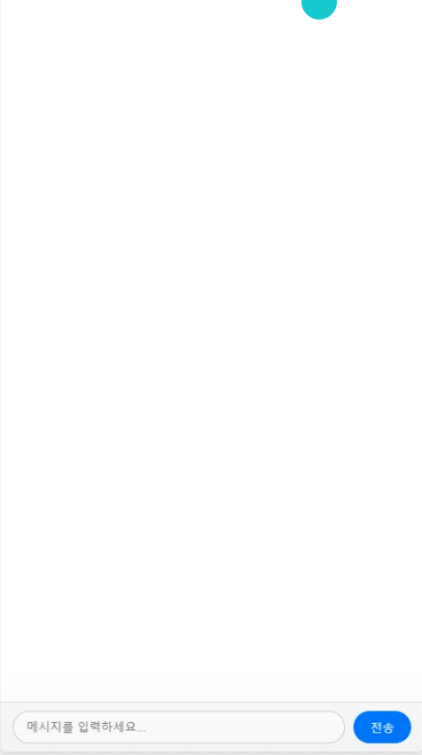
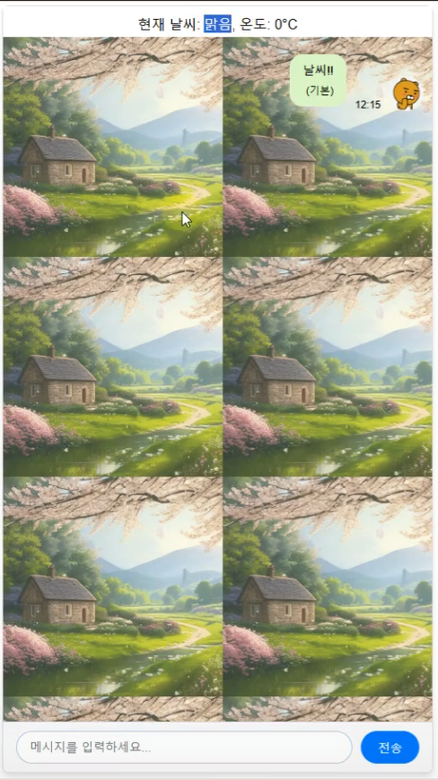
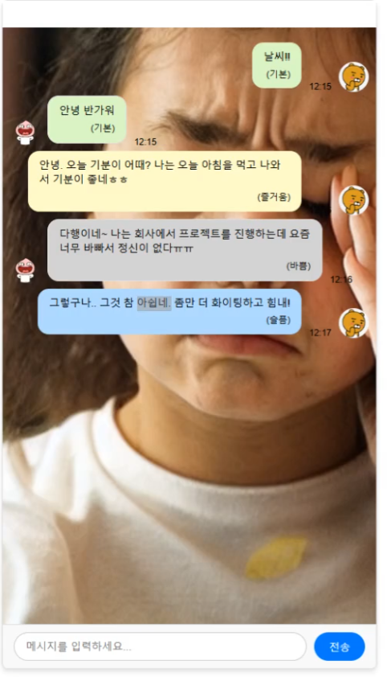

# 🙂AI로 감정 ON🤣

## 💻 `프로젝트 소개 & 개발 동기`

“감정을 시각화하다 : AI 기반 감정 맞춤형 채팅 플랫폼”<br/><br/>
사용자가 텍스트를 입력하면, AI 감정 분석 모델이 입력된 텍스트에서 사용자의 감정을 파악하고, 이미지 생성 모델이 해당 감정에 어울리는 배경 이미지를 실시간으로 생성.
이를 통해 사용자는 자신의 감정을 보다 생생하게 표현하고, 시각적 요소를 통해 상대방과 더욱 풍부하게 소통 가능. 이 서비스는 감정을 전달하는 새로운 방식을 제시하며, 개인화된 경험을 통해 사용자가 공감과 감정의 치유를 느낄 수 있도록 도와줌.
<br/>

## 🔮 `프로젝트 기대효과`

1. 사용자 경험 향상<br/>
- 실시간 감정 분석과 맞춤형 배경 제공을 통해 사용자가 자신의 감정을 직관적으로 확인 가능.
- 감정 기반 시각화로 더 재미있고 몰입감 있는 채팅 경험 제공.
<br/>

2. 재미와 차별화 요소 제공<br/>
- 단순 채팅 이상의 기능을 제공하며, 사용자들에게 새로운 재미와 감정 공유 경험을 선사.
- 사용자의 감정을 토대로 감정 기반의 배경 화면으로 획기적인 서비스 제공.
<br/>

3. 확장성<br/>
- 추천 시스템: 감정 기반 콘텐츠 추천 (음악, 영화, 메시지 등)
- 다른 서비스 연동 및 통합 : 타 플랫폼(소셜 미디어, 메신저)과 연동 하여 감정 기반 시각화를 제공.

<br/>

## 🧑‍🤝‍🧑 `멤버구성 & 담당 역할`

 - 🐯 팀장: 임현성
 - 🦓 이현승
 - 🐶 지동현
 - 🐹 배하은
 - 🐻 정원호
 - 🦝 노태윤


<br/>

## ⚙️ `개발 환경`


<br/>
<br/><h2>📂 패키지구조</h2>

  <summery><b>프론트엔드 패키지 구조</b></summery>
  <div markdown="1">

```
📦src
 ┣ 📂assets
 ┃ ┗ 📂css
 ┃ ┃ ┗ 📜main.css
 ┣ 📂components
 ┃ ┗ 📜ChatRoom.jsx
 ┣ 📜App.css
 ┣ 📜App.js
 ┣ 📜App.test.js
 ┣ 📜index.css
 ┣ 📜index.js
 ┣ 📜logo.svg
 ┣ 📜reportWebVitals.js
 ┗ 📜setupTests.js
```
    
  </div>

   <summery><b>백엔드 패키지 구조</b><summery>
  <div markdown="1">

```
📦backend
 ┣ 📂app
 ┃ ┣ 📂models
 ┃ ┃ ┣ 📂__pycache__
 ┃ ┃ ┃ ┣ 📜color_generator.cpython-312.pyc
 ┃ ┃ ┃ ┣ 📜emotion.cpython-312.pyc
 ┃ ┃ ┃ ┗ 📜emotion_and_color.cpython-312.pyc
 ┃ ┃ ┣ 📜color_generator.py
 ┃ ┃ ┣ 📜emotion.py
 ┃ ┃ ┗ 📜emotion_and_color.py
 ┃ ┣ 📂__pycache__
 ┃ ┃ ┣ 📜api.cpython-312.pyc
 ┃ ┃ ┣ 📜chat_server.cpython-312.pyc
 ┃ ┃ ┣ 📜image_server.cpython-312.pyc
 ┃ ┃ ┗ 📜tasks.cpython-312.pyc
 ┃ ┗ 📜api.py
 ┣ 📂image
 ┃ ┣ 📜angry.png
 ┃ ┣ 📜busy.png
 ┃ ┣ 📜calm.png
 ┃ ┣ 📜joyful.png
 ┃ ┣ 📜sad.png
 ┃ ┗ 📜upset.png
 ┣ 📂__pycache__
 ┃ ┗ 📜main.cpython-312.pyc
 ┣ 📜.env
 ┣ 📜main.py
 ┗ 📜requirements.txt
```
    
  </div>


<br/>
<br/><h2>📌 주요 기능</h2>

<br/><h3>1.  실시간 채팅 (WebSocket) </h3>
- 사용자 간 입력된 감정을 즉각적으로 공유.
- 대화 흐름에 감정을 반영하여 더욱 직관적인 사용자 경험 제공.

<br/><h3>2. 감정 분석 & 이미지 생성 </h3>
텍스트 -> 감정 추출 -> 배경 이미지 생성
- 자동으로 사용자가 입력한 텍스트를 분석하여 감정을 분류.
- 감정에 적합한 배경 이미지를 시각화.
- 
<br/><h3>3. 실시간 날씨 표시 기능 </h3>
- 사용자의 위치 기반으로 실시간 날씨 정보 제공 (현재 날씨, 섭씨 온도)
- 사용자의 지역에 있는 위치 기반의 날씨를 참조하여 배경 이미지 생성

<br/>

## 🗣️ 후기

>- <b>🐯 팀장: 임현성🐯 </b><br>
채팅: DB 연동해 감정 분석, 양쪽의 감정을 합쳐 실시간 변화 적용하고 싶음
모델: 설치 및 선택에 고민이 많았음
파이썬: 오류 확인이 자바보다 까다로움.
타임라인에 맞춰 팀원들이 모델 탐색 및 개발을 진행하여 빠르게 완성할 수 있었음

>- <b>🦓 이현승 🦓</b><br>
bert 모델을 학습시켜 날씨와 관련된 이야기를 한다면그날 날씨 이미지를 보여주려고 했으나 막대한 데이터를 학습하는데 어려움을 느껴 사용하지 못했음.
시간이 좀 더 주어진다면 충분한 학습을 통해 AI채팅분석을 사용해 보고 싶음.

>- <b>🐹 배하은 🐹</b><br>
채팅과 이미지 생성 기능을 비동기식으로 처리하려 했으나, 특정 감정의 이미지를 생성 중 다른 감정 처리가 복잡해 어려움을 겪음.
시간이 좀 더 있다면 DB를 만들어서 이미지 생성과 메세지 입력을 비동기식으로 하고 싶었다.

>- <b>🐶 지동현 🐶</b><br>
GPU를 사용하여도 이미지가 생성되는 시간에 딜레이가 발생하였다.
프롬프트를 수차례 테스트 해 보았지만 감정에 딱 맞는 이미지가 생성되는 빈도수가 기대에 못 미친 아쉬움이 있었다.

>- <b>🐻 정원호 🐻</b><br>
감정의 깊이 감정의 내용을 통해 감정과 색을 맵핑하여 배경색을 지정해주려 했으나 ai 모델이 필요가 없다고 생각해 보류. 감정의 변화에 따른 이미지변화를 부드럽게 표현해보고 싶다.

>- <b>🦝 노태윤 🦝</b><br>
DB 연동 을 통해 사용자의 채팅 기록이 남게 했으면 더 완성도가 높았을것 같다.
AI 모델이 CPU 환경 보다 GPU 환경에서 더 빠르게 돌아가다보니, 다음엔 GPU 환경을 셋팅한다음에 해봤으면 좋았을것 같다.

<br/>

## 🎃 웹 스크린 구성 및 기능

| **기본** |  **날씨**  |  **감정이미지 ** |
| :---:|:---:|:---:|
|  |  |  |

