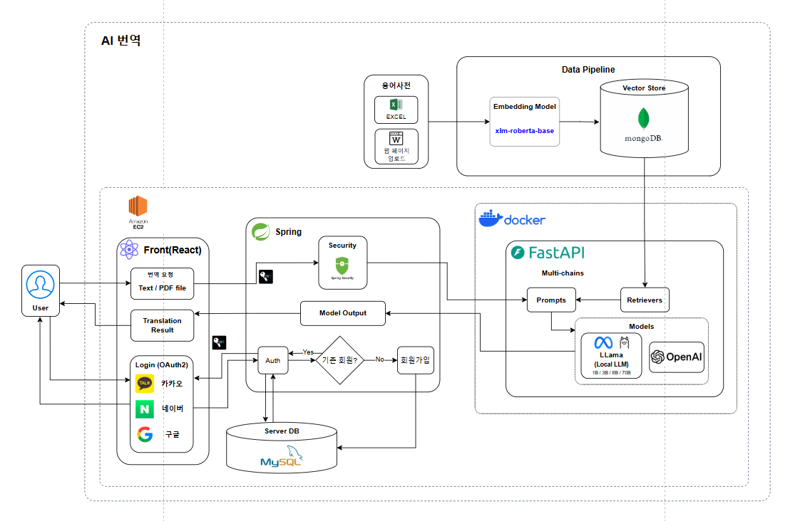
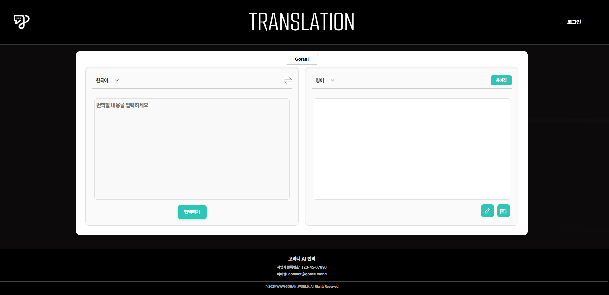
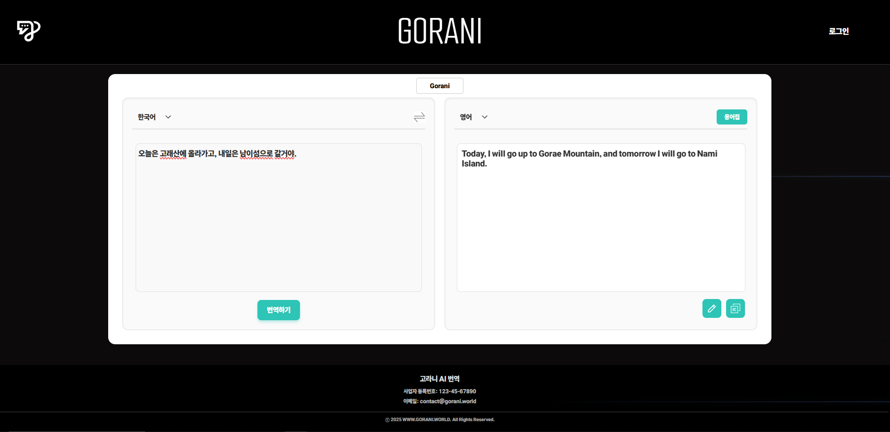
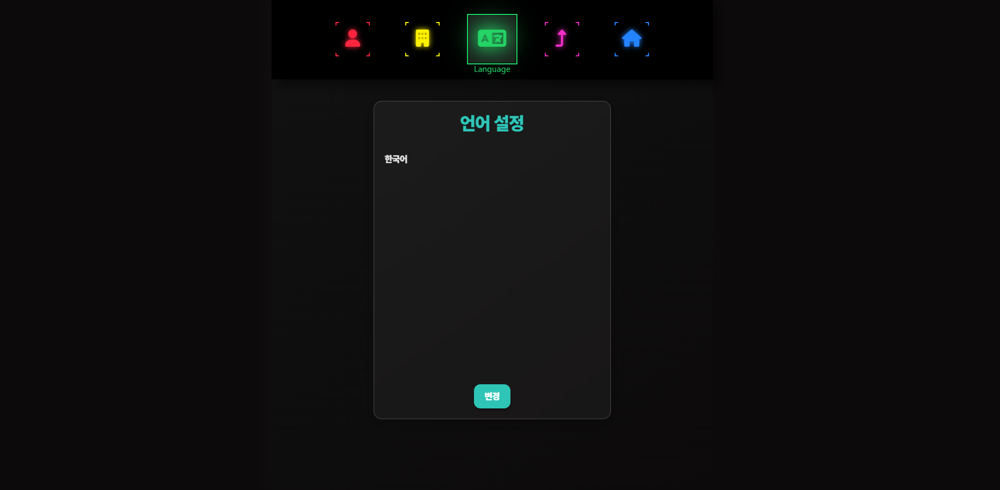

# 🦌 Gorani 번역 🦌

## 💻 프로젝트 개요  
**" 관광 산업의 새로운 AI 혁신, Gorani! " <br/>**

**Gorani**는 관광 산업에 특화된 자체 AI 언어 모델로, **LLAMA 모델을 기반으로 Fine-Tuning**하여 외국인 관광객을 위한 번역 성능을 향상시키는 프로젝트입니다.  <br/>
한국을 방문하는 외국인 관광객 수는 매년 증가하고 있으며, 이에 따라 관련 산업도 빠르게 성장하고 있습니다.   <br/>
하지만 현재 많은 기업이 **보안 문제, 비용 부담, 커스텀 모델 부족** 등의 한계를 겪고 있어, **자체 LLM(대형 언어 모델) 개발**에 대한 필요성이 높아지고 있습니다.   <br/>

**Gorani는 이러한 흐름에 맞춰, 오픈소스 기반 LLM을 Fine-Tuning하여 관광 분야에 최적화된 AI 모델을 구축**된 모델입니다.   <br/>
이를 통해 **보다 정확하고 자연스러운 다국어 번역**을 지원하여 외국인 관광객의 경험을 향상시키고, 기업들이 보다 효율적으로 AI를 활용할 수 있도록 돕습니다.   <br/>

---

##  🔮 기대 효과  

**1. 관광 산업 맞춤형 AI 번역 서비스 제공**  
**2. 자체 LLM을 통한 비용 절감 및 보안 강화**  
**3. 다국어 지원 최적화로 외국인 관광객의 편의 증대**  


## 🧑‍🤝‍🧑 `멤버구성`

 - 🐯 팀장: 임현성
 - 🦓 이현승
 - 🐶 지동현
 - 🐹 배하은
 - 🦝 노태윤


<br/>

## ⚙️ `개발 환경`


 


 


<br/>
<br/><h2>📂 패키지구조</h2>

  <summery><b>프론트엔드 패키지 구조</b></summery>
  <div markdown="1">

```
📦src

```
    
  </div>

   <summery><b>백엔드 패키지 구조</b><summery>
  <div markdown="1">

```
📦backend

```
    
  </div>

  <summery><b>AI 패키지 구조</b></summery>
  <div markdown="1">

```
📦src

```
    
  </div>


## 🎬 `아키텍처`
  

<br/>
<br/><h2>📌 **주요 기능**</h2>

### 🔍 번역 모델 Fine-Tuning  
- **Base Model:** OpenAI GPT-4o-mini  
- **Target Model:** LLAMA (1B / 3B / 8B)  
- **목표:** 여행/관광 도메인 번역 정확도 향상  
- **방법:**  
  - 문맥, 어휘 등을 고려한 **고품질 학습 데이터셋 수집 및 Fine-Tuning**  
  - **관광 관련 전문 용어 및 속어 반영**하여 보다 자연스러운 번역 제공  

### 📚 RAG & VectorStore 성능 향상  
- **다국어 번역 단어쌍 용어사전 구축**  
  - 여행/관광 업계에서 자주 사용되는 핵심 용어 정리 및 번역  
  - 단순 번역이 아닌 **문맥을 고려한 다국어 매칭** 수행  
- **각 단어에 대한 벡터 임베딩 값을 MongoDB에 저장**하여 빠르고 정확한 검색 성능 제공  
  - **VectorStore 기반 빠른 검색 및 추천 시스템 적용**  

### 📝 Prompt Engineering  
- **명확한 지시어 적용**  
  - 번역 품질을 높이기 위한 **세밀한 프롬프트 설계**  
  - 특정 국가별 문화적 차이를 반영한 **맞춤형 지시어 활용**  
- **One-shot & Few-shot 기법 활용**으로 다양한 입력 방식에 대응  
  - 사용자 입력 의도를 고려한 **다양한 응답 패턴 생성**  


---

## 🗣️ 후기

>- <b>🐯 팀장: 임현성🐯 </b><br>
채팅: DB 연동해 감정 분석, 양쪽의 감정을 합쳐 실시간 변화 적용하고 싶음
모델: 설치 및 선택에 고민이 많았음
파이썬: 오류 확인이 자바보다 까다로움.
타임라인에 맞춰 팀원들이 모델 탐색 및 개발을 진행하여 빠르게 완성할 수 있었음

>- <b>🦓 이현승 🦓</b><br>
bert 모델을 학습시켜 날씨와 관련된 이야기를 한다면그날 날씨 이미지를 보여주려고 했으나 막대한 데이터를 학습하는데 어려움을 느껴 사용하지 못했음.
시간이 좀 더 주어진다면 충분한 학습을 통해 AI채팅분석을 사용해 보고 싶음.

>- <b>🐹 배하은 🐹</b><br>
채팅과 이미지 생성 기능을 비동기식으로 처리하려 했으나, 특정 감정의 이미지를 생성 중 다른 감정 처리가 복잡해 어려움을 겪음.
시간이 좀 더 있다면 DB를 만들어서 이미지 생성과 메세지 입력을 비동기식으로 하고 싶었다.

>- <b>🐶 지동현 🐶</b><br>
GPU를 사용하여도 이미지가 생성되는 시간에 딜레이가 발생하였다.
프롬프트를 수차례 테스트 해 보았지만 감정에 딱 맞는 이미지가 생성되는 빈도수가 기대에 못 미친 아쉬움이 있었다.

>- <b>🐻 정원호 🐻</b><br>
감정의 깊이 감정의 내용을 통해 감정과 색을 맵핑하여 배경색을 지정해주려 했으나 ai 모델이 필요가 없다고 생각해 보류. 감정의 변화에 따른 이미지변화를 부드럽게 표현해보고 싶다.

>- <b>🦝 노태윤 🦝</b><br>
DB 연동 을 통해 사용자의 채팅 기록이 남게 했으면 더 완성도가 높았을것 같다.
AI 모델이 CPU 환경 보다 GPU 환경에서 더 빠르게 돌아가다보니, 다음엔 GPU 환경을 셋팅한다음에 해봤으면 좋았을것 같다.

<br/>

## 🎃 웹 스크린 구성 및 기능

| **메인페이지** |  **번역**  | 
| :---:|:---:|
|  |  |
 | **용어집** |  **마이페이지** |
| :---:|:---:|
|  |  |
